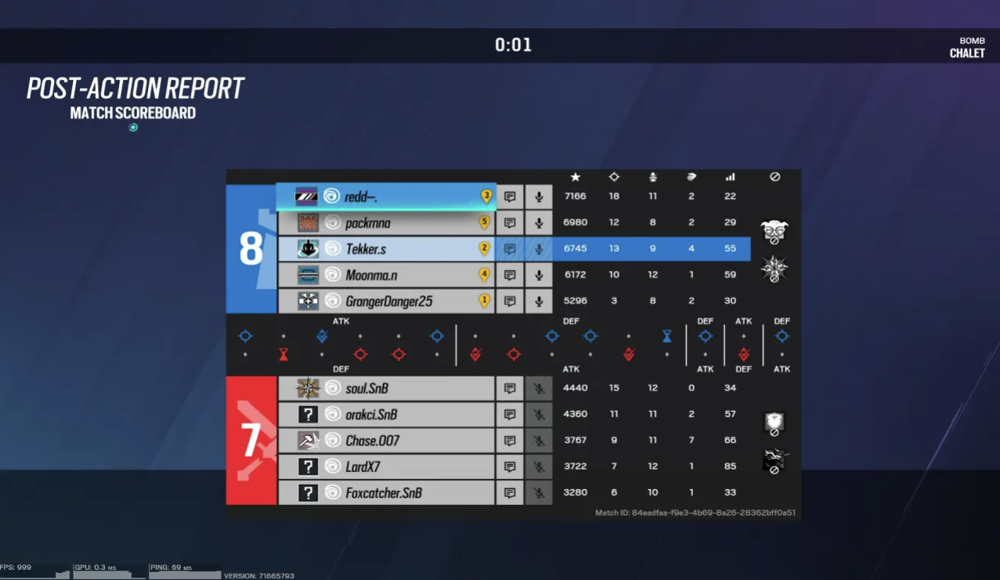

# PRSTATS

Follow this guide to learn all about PRStats' workflow.

## Introduction

This guide teaches you the essentials behind the PRStats system. You'll see the pipeline in action, highlighting a robust and efficient manner to fetch and provide Rainbow Six Siege statistics.

## Prerequisites

- You must have admin-level and/or admin-adjacent permissions in the Packrunners Discord; otherwise, nothing will be written to the database.
- Ensure you have access to the Packrunners web tool and the Discord bot commands.

## Step 1: Obtain In-Game Screenshot

The first thing we need to do is obtain an in-game screenshot of the scoreboard. This must be a screenshot that you fetch by invoking some sort of keyboard shortcut and/or using a snipping tool. Taking pictures of the scoreboard with one's phone will jeopardize accuracy since the quality of the scoreboard will likely not be as good.

**Good Screenshot:**

**Bad Screenshot:**

The scoreboard must display all names and figures such as kills, deaths, and assists (the system does not handle fragmented screenshots; it must all be in one).

## Step 2: Upload the File, Capture Relevant Parts

Now, go to our [webtool](link_to_the_webtool) and upload the file. You should now be able to see the scoreboard in the canvas as seen below:

This web tool allows us to snip out the relevant parts of each scoreboard. This includes four separate parts: Team 1's names, Team 1's actual stats, Team 2's names, Team 2's actual stats. This means that we must snip out 4 separate rectangles within the scoreboard as such:

**Good Symmetry:**

**Bad Symmetry:**

## Step 3: Input All Other Match-Related Info

The next step is to fill in all of the necessary match-related information. We have 3 separate fields to fill out:

- **Match Type**: Composed of 3 types namely seeding, playoff, and finals. Select the one related to the match for which the current scoreboard corresponds to.
- **Final Score**: Enter the final score for this match. The format is Team 1 - Team 2; the team at the bottom of the scoreboard is team 2, team 1 is always the team at the top.
- **Map**: Enter the map for which the current scoreboard/match pertained to.

The figure above shows a seeding game played on Chalet, finishing with a score of 7-4 (Team 1 won 7 rounds, Team 2 won 4 rounds).

## Step 4: Invoke !upload Command

Now we must initiate the processing pipeline for our data. Invoke the `!upload` command in a designated text channel within Discord and receive a code from the PRStats bot. This code must be entered into the final field in order to successfully trigger the upload.

## Step 5: Await Feedback from PRStats

Once the data goes through most of the pipeline, we will reach the correction stage. This is where the system asks the user for confirmation and potential feedback on the extracted data. If there's any changes that need to be made, this is where it happens:

You will receive a message from PRStats as shown:

If there are any corrections to be made, follow the workflow invoked by the bot. Otherwise, submit the corrections and the final data will be written to the database successfully (There's no going back from here)!

Assuming a successful upload and little to no corrections needed, the data shall now be stored and found within Packrunners database. Any pulling of player information will be done from this database.
